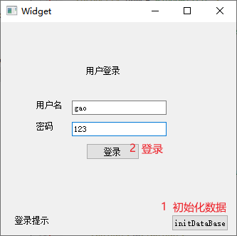
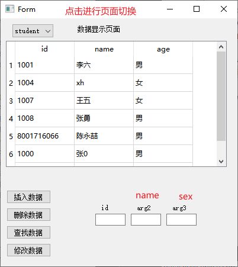
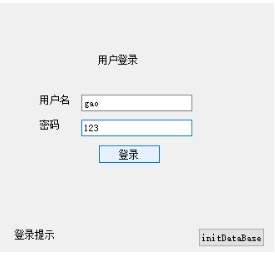
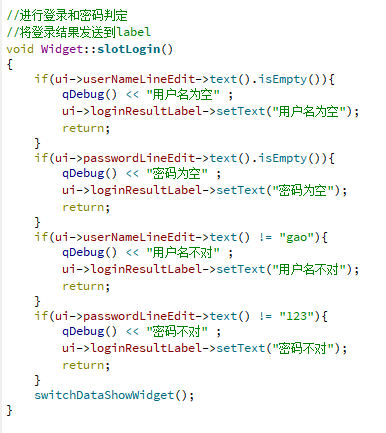
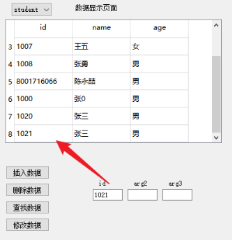
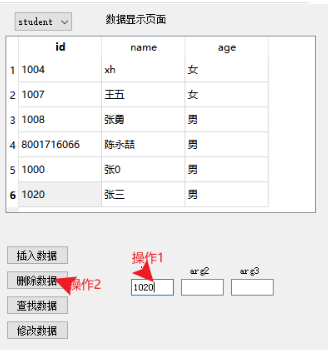
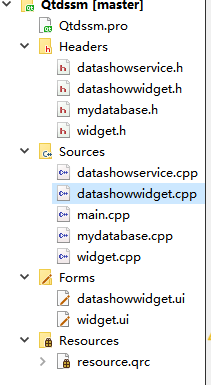
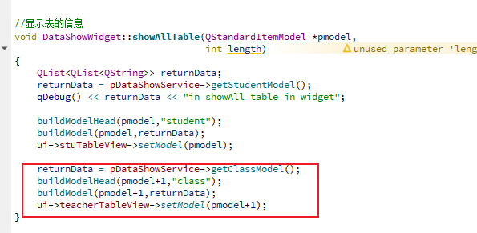

介绍：
项目是培训要求实现的小功能,
其中的部分代码来自网络摘抄修改

使用技术：QT，sqllite，C++，信号和槽

### 实现功能：

1，登录界面

2，数据库增删改查界面

  (1), insert   查找
  (2), deletale  删除
  (3), select  查找
  (4), update  修改

### 项目使用：

1,第一次使用，可能需要点击login页面的initbase，进行数据库的初始化
2,登录账号gao  密码123,   账号密码耦合在代码中

### 实现功能详细说明

由于项目的后期补足的内容主要是,sql语句的编写，所以只编写了student表的增删改查

#### 0,sql文件

  sql文件是随便在网络上找的学生管理系统的sql文件，对应的sql比较详细，
  涉及表格很多，涉及单表的列数也比较多,所以在某些环节进行精简

#### 1，登录界面

  (1),登录的账号密码目前耦合在代码中

#### 2，数据库增删改查界面

  (1), insert   插入,  只能通过id修改进行插入，由于insert语句过长，所以默认写死在代码中，通过修改id进行插入

  (2), deletale  删除  只能通过id进行删除

  (3), select  查找    未封装单行查询，  只封装了全表查询

  (4), update  修改    只能修改name

#### 2, 数据库表

  (1), 只设计了三个表头，只显示三列数据
  (2), 使用stackwidget的方式，通过combox进行切换表格

### 使用其他元素

1, sql初始化文件

### 项目设计

1,设计架构：
  使用三层，view,   视图操作 eg； datashowwidget.cpp  widget.cpp
            service, 业务操作  eg: datashowservice.cpp
            model   数据库操作  eg: mydatabase.cpp

  进行函数的分层编写，分离功能

### 项目后期补足点:

1, 从数据库表中查找账号密码
2，增加多个表的显示，实现方法

我创建了10个pmodel，所以是10个表，想要对第二个表进行操作，
就可以使用pmodel + 1的方式进行使用

### 项目注意点

  1,sql语句往往在拼接过程中涉及 '等标点符号的遗忘问题，建议qDebug的方式进行调试
  2，项目中的qDebug调试语句没有删除，如果不想要，可以全局查找进行删除
